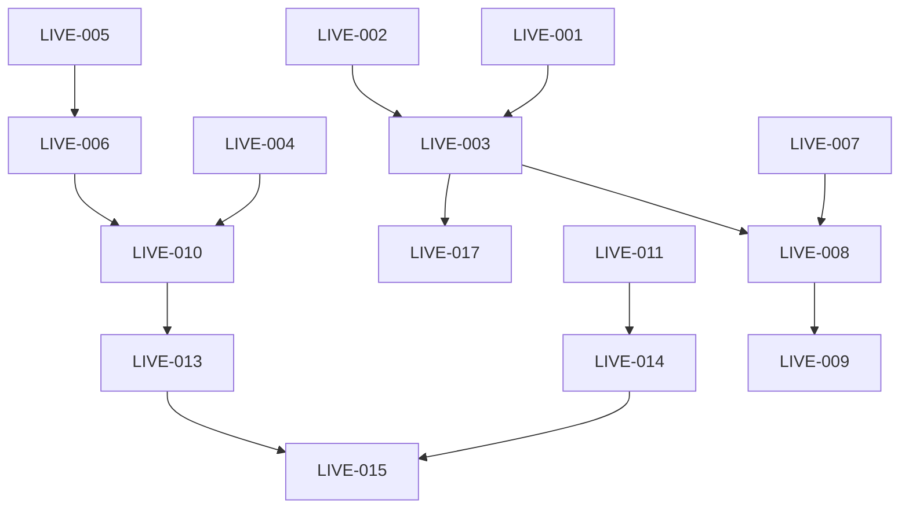

# Linear Project Structure - Live Stock Data Integration

## Project: Live Market Data Integration
**Description:** Implement real-time stock quotes, volume, and market cap data for 4,600+ US stocks using free-tier APIs with intelligent caching and tiered updates.

**Timeline:** 4 weeks
**Priority:** High
**Labels:** `feature`, `backend`, `frontend`, `infrastructure`

---

## Epic 1: API Integration Layer
**Goal:** Build robust API clients for Alpha Vantage and Finnhub with rate limiting and error handling

### Issues:

#### LIVE-001: Alpha Vantage API Client
**Priority:** High
**Estimate:** 5 points
**Labels:** `backend`, `api`
**Description:** Implement Alpha Vantage API client with batch support
**Acceptance Criteria:**
- [ ] Create Go client for Alpha Vantage API
- [ ] Implement GLOBAL_QUOTE endpoint
- [ ] Implement BATCH_STOCK_QUOTES endpoint (100 symbols)
- [ ] Add retry logic with exponential backoff
- [ ] Handle API errors and rate limits
- [ ] Write unit tests with mocked responses

#### LIVE-002: Finnhub API Client
**Priority:** High
**Estimate:** 5 points
**Labels:** `backend`, `api`
**Description:** Implement Finnhub API client for real-time quotes
**Acceptance Criteria:**
- [ ] Create Go client for Finnhub API
- [ ] Implement quote endpoint
- [ ] Add connection pooling
- [ ] Handle rate limiting (60 req/min)
- [ ] Add error handling and logging
- [ ] Write unit tests

#### LIVE-003: API Manager with Rate Limiting
**Priority:** Critical
**Estimate:** 8 points
**Labels:** `backend`, `architecture`
**Description:** Create intelligent API manager to coordinate between data sources
**Acceptance Criteria:**
- [ ] Implement rate limiter per API provider
- [ ] Create provider selection logic
- [ ] Add circuit breaker pattern
- [ ] Implement fallback mechanism
- [ ] Track API usage in database
- [ ] Add comprehensive logging

---

## Epic 2: Caching & Database Layer
**Goal:** Implement Redis caching and PostgreSQL schema for live market data

### Issues:

#### LIVE-004: Redis Caching Layer
**Priority:** High
**Estimate:** 5 points
**Labels:** `backend`, `infrastructure`, `cache`
**Description:** Setup Redis for caching live market data
**Acceptance Criteria:**
- [ ] Add Redis to docker-compose.yml
- [ ] Create Redis client wrapper in Go
- [ ] Implement cache key structure (quote:{symbol}, etc.)
- [ ] Add TTL management (5-min for quotes)
- [ ] Create cache invalidation logic
- [ ] Monitor cache hit/miss ratio

#### LIVE-005: Database Schema Migration
**Priority:** High
**Estimate:** 3 points
**Labels:** `backend`, `database`
**Description:** Create database tables for live market data
**Acceptance Criteria:**
- [ ] Create market_data_live table
- [ ] Create api_usage tracking table
- [ ] Add proper indexes
- [ ] Write migration scripts
- [ ] Test rollback procedures
- [ ] Document schema changes

#### LIVE-006: Data Persistence Layer
**Priority:** Medium
**Estimate:** 5 points
**Labels:** `backend`, `database`
**Description:** Implement data access layer for live market data
**Acceptance Criteria:**
- [ ] Create repository pattern for market data
- [ ] Implement batch insert operations
- [ ] Add transaction support
- [ ] Create data retrieval methods
- [ ] Optimize query performance
- [ ] Write integration tests

---

## Epic 3: Update Scheduler & Background Jobs
**Goal:** Implement tiered update strategy for different stock categories

### Issues:

#### LIVE-007: Tiered Stock Classification
**Priority:** High
**Estimate:** 3 points
**Labels:** `backend`, `data`
**Description:** Classify stocks into tiers based on activity
**Acceptance Criteria:**
- [ ] Define tier criteria (volume, market cap)
- [ ] Create classification algorithm
- [ ] Store tier assignments in database
- [ ] Add admin endpoint to adjust tiers
- [ ] Create daily reclassification job

#### LIVE-008: Background Update Scheduler
**Priority:** Critical
**Estimate:** 8 points
**Labels:** `backend`, `scheduler`
**Description:** Implement background jobs for tiered updates
**Acceptance Criteria:**
- [ ] Create cron job for Tier 1 (5-min updates)
- [ ] Create cron job for Tier 2 (15-min updates)
- [ ] Create daily batch job for Tier 3
- [ ] Implement job queuing system
- [ ] Add job failure recovery
- [ ] Create monitoring dashboard

#### LIVE-009: Batch Processing Optimization
**Priority:** Medium
**Estimate:** 5 points
**Labels:** `backend`, `performance`
**Description:** Optimize batch API calls for 4,600 stocks
**Acceptance Criteria:**
- [ ] Implement parallel processing
- [ ] Add batch size optimization
- [ ] Create progress tracking
- [ ] Handle partial failures
- [ ] Add performance metrics
- [ ] Test with full stock universe

---

## Epic 4: API Endpoints & Backend Services
**Goal:** Create RESTful endpoints for live market data

### Issues:

#### LIVE-010: Live Quote Endpoint
**Priority:** High
**Estimate:** 3 points
**Labels:** `backend`, `api`
**Description:** Implement GET /api/v1/tickers/:symbol/live
**Acceptance Criteria:**
- [ ] Create endpoint handler
- [ ] Add request validation
- [ ] Implement cache-first strategy
- [ ] Add response formatting
- [ ] Include data source attribution
- [ ] Write API tests

#### LIVE-011: Batch Market Data Endpoint
**Priority:** Medium
**Estimate:** 5 points
**Labels:** `backend`, `api`
**Description:** Implement GET /api/v1/market/live for multiple symbols
**Acceptance Criteria:**
- [ ] Accept array of symbols
- [ ] Implement pagination
- [ ] Add filtering options
- [ ] Optimize for bulk requests
- [ ] Add rate limiting per client
- [ ] Document API usage

#### LIVE-012: Market Status Service
**Priority:** Low
**Estimate:** 3 points
**Labels:** `backend`, `feature`
**Description:** Create service to track market hours and status
**Acceptance Criteria:**
- [ ] Implement market hours logic
- [ ] Add holiday calendar
- [ ] Create pre/post market detection
- [ ] Add market status endpoint
- [ ] Cache market status

---

## Epic 5: Frontend Integration
**Goal:** Display live market data in the UI with auto-refresh

### Issues:

#### LIVE-013: Live Data Components
**Priority:** High
**Estimate:** 5 points
**Labels:** `frontend`, `component`
**Description:** Create React components for live data display
**Acceptance Criteria:**
- [ ] Create PriceQuote component
- [ ] Create VolumeIndicator component
- [ ] Create MarketCap display
- [ ] Add price change indicators (▲▼)
- [ ] Implement number formatting
- [ ] Add loading states

#### LIVE-014: Real-time Data Hook
**Priority:** High
**Estimate:** 5 points
**Labels:** `frontend`, `feature`
**Description:** Create React hook for fetching and refreshing live data
**Acceptance Criteria:**
- [ ] Create useLiveQuote hook
- [ ] Implement auto-refresh logic
- [ ] Add stale data detection
- [ ] Handle connection errors
- [ ] Add retry mechanism
- [ ] Optimize re-renders

#### LIVE-015: Stock Detail Page Enhancement
**Priority:** Medium
**Estimate:** 3 points
**Labels:** `frontend`, `ui`
**Description:** Integrate live data into existing stock detail page
**Acceptance Criteria:**
- [ ] Add live price to header
- [ ] Show real-time volume
- [ ] Display market cap
- [ ] Add last updated timestamp
- [ ] Show data source
- [ ] Add refresh button

#### LIVE-016: Market Overview Dashboard
**Priority:** Low
**Estimate:** 8 points
**Labels:** `frontend`, `feature`
**Description:** Create dashboard showing top movers and market stats
**Acceptance Criteria:**
- [ ] Create dashboard layout
- [ ] Show top gainers/losers
- [ ] Display market indices
- [ ] Add volume leaders
- [ ] Implement auto-refresh
- [ ] Add export functionality

---

## Epic 6: Monitoring & Observability
**Goal:** Implement comprehensive monitoring for the live data system

### Issues:

#### LIVE-017: API Usage Monitoring
**Priority:** High
**Estimate:** 5 points
**Labels:** `backend`, `monitoring`
**Description:** Track and visualize API usage and limits
**Acceptance Criteria:**
- [ ] Track requests per provider
- [ ] Monitor rate limit usage
- [ ] Create usage dashboards
- [ ] Add alerting for 80% limit
- [ ] Generate daily reports
- [ ] Predict limit breaches

#### LIVE-018: Performance Metrics
**Priority:** Medium
**Estimate:** 5 points
**Labels:** `backend`, `monitoring`
**Description:** Implement performance tracking
**Acceptance Criteria:**
- [ ] Track API response times
- [ ] Monitor cache performance
- [ ] Measure update latency
- [ ] Add database query metrics
- [ ] Create performance dashboard
- [ ] Set up alerts for degradation

#### LIVE-019: Error Tracking and Alerts
**Priority:** High
**Estimate:** 3 points
**Labels:** `backend`, `monitoring`
**Description:** Set up error tracking and alerting system
**Acceptance Criteria:**
- [ ] Integrate error tracking service
- [ ] Create alert rules
- [ ] Set up PagerDuty/Slack alerts
- [ ] Add error recovery metrics
- [ ] Create runbook documentation

---

## Epic 7: Testing & Documentation
**Goal:** Ensure system reliability and maintainability

### Issues:

#### LIVE-020: Integration Testing Suite
**Priority:** High
**Estimate:** 8 points
**Labels:** `testing`, `quality`
**Description:** Create comprehensive integration tests
**Acceptance Criteria:**
- [ ] Test API client integrations
- [ ] Test cache layer
- [ ] Test database operations
- [ ] Test scheduler jobs
- [ ] Add load testing
- [ ] Create test data fixtures

#### LIVE-021: API Documentation
**Priority:** Medium
**Estimate:** 3 points
**Labels:** `documentation`, `api`
**Description:** Document new API endpoints
**Acceptance Criteria:**
- [ ] Add OpenAPI/Swagger specs
- [ ] Create usage examples
- [ ] Document rate limits
- [ ] Add authentication guide
- [ ] Create troubleshooting guide

#### LIVE-022: Deployment Documentation
**Priority:** High
**Estimate:** 3 points
**Labels:** `documentation`, `devops`
**Description:** Create deployment and configuration guides
**Acceptance Criteria:**
- [ ] Document environment variables
- [ ] Create deployment checklist
- [ ] Add rollback procedures
- [ ] Document monitoring setup
- [ ] Create operational runbook

---

## Milestones

### Milestone 1: API Integration Complete (Week 1)
- LIVE-001: Alpha Vantage API Client ✓
- LIVE-002: Finnhub API Client ✓
- LIVE-003: API Manager with Rate Limiting ✓

### Milestone 2: Data Layer Ready (Week 2)
- LIVE-004: Redis Caching Layer ✓
- LIVE-005: Database Schema Migration ✓
- LIVE-006: Data Persistence Layer ✓
- LIVE-007: Tiered Stock Classification ✓

### Milestone 3: Backend Services Complete (Week 3)
- LIVE-008: Background Update Scheduler ✓
- LIVE-009: Batch Processing Optimization ✓
- LIVE-010: Live Quote Endpoint ✓
- LIVE-011: Batch Market Data Endpoint ✓

### Milestone 4: Frontend Integration & Launch (Week 4)
- LIVE-013: Live Data Components ✓
- LIVE-014: Real-time Data Hook ✓
- LIVE-015: Stock Detail Page Enhancement ✓
- LIVE-017: API Usage Monitoring ✓
- LIVE-020: Integration Testing Suite ✓

---

## Dependencies

---

## Team Allocation Suggestions

### Backend Team (2 engineers)
- Engineer 1: API Integration (LIVE-001, LIVE-002, LIVE-003)
- Engineer 2: Data Layer (LIVE-004, LIVE-005, LIVE-006)

### Full-Stack Engineer
- Scheduler & Jobs (LIVE-007, LIVE-008, LIVE-009)
- API Endpoints (LIVE-010, LIVE-011, LIVE-012)

### Frontend Team (1-2 engineers)
- Components & Integration (LIVE-013, LIVE-014, LIVE-015, LIVE-016)

### DevOps/SRE
- Monitoring & Infrastructure (LIVE-017, LIVE-018, LIVE-019)

### QA Engineer
- Testing & Documentation (LIVE-020, LIVE-021, LIVE-022)

---

## Risk Mitigation

### High Risk Items
1. **API Rate Limits** (LIVE-003)
   - Mitigation: Implement robust rate limiting and fallback mechanisms
   
2. **Data Freshness for 4,600 stocks** (LIVE-008, LIVE-009)
   - Mitigation: Tiered approach with intelligent prioritization

3. **Cache Invalidation** (LIVE-004)
   - Mitigation: Clear TTL strategy with monitoring

### Medium Risk Items
1. **API Provider Changes** (LIVE-001, LIVE-002)
   - Mitigation: Abstract provider interface for easy swapping

2. **Performance at Scale** (LIVE-009)
   - Mitigation: Load testing and optimization early

---

## Success Criteria

### Launch Criteria
- [ ] All 4,600 stocks updating successfully
- [ ] < 5 second data latency for Tier 1 stocks
- [ ] 0 API rate limit violations in 24 hours
- [ ] > 90% cache hit ratio
- [ ] All integration tests passing
- [ ] Monitoring dashboards operational

### Post-Launch Metrics (Week 1)
- API uptime > 99.9%
- Average response time < 200ms
- Zero data discrepancies reported
- Successful daily batch runs
- No manual intervention required